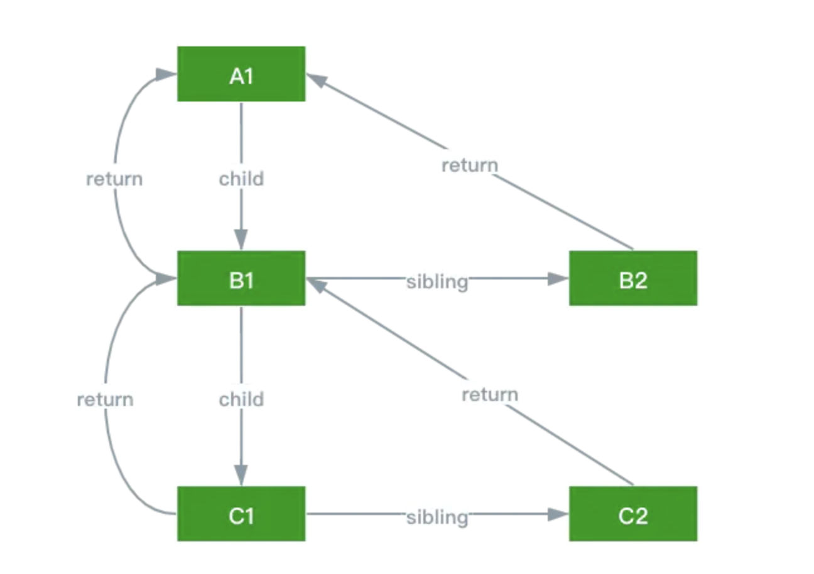
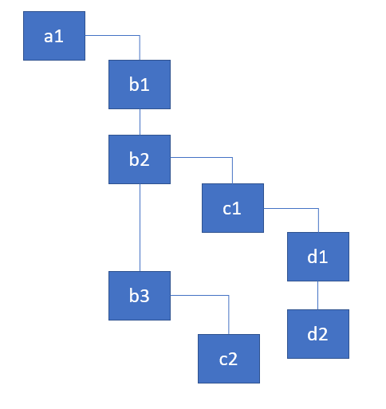
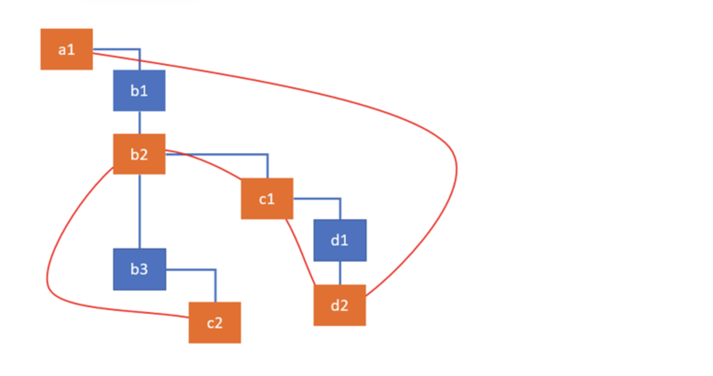
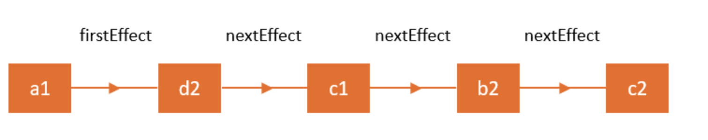

## 什么是fiber？为什么要有fiber
1. fiber是React更新到v16版本之后，出现在React中的词汇。
2. fiber的出现和React v16以后的架构有关。
  既然说到新架构，那就必须比对一下老架构。
    - 旧版本 
      在React中有虚拟dom的概念，在早先版本中React使用Reconciler进行虚拟dom的比对，比对完成后再进行render更新dom
      虚拟dom最大的意义就是将耗性能的dom操作转换成js运算，真正操作dom是替换最终的运算结果
      遇到的问题是reconciler在mount和update阶段都会有递归运算，如果这部操作费时那么性能就受影响
    - 新版本 
      为了解决上面的问题，整体架构上多了一个Scheduler，可以简单理解为Scheduler就是requestIdleCallback这个API，所有的虚拟dom运算都在浏览器执行帧的空余时间运行（当然，React自己实现Scheduler的原因是架构上要兼容非浏览器场景，同时也有浏览器端的性能和兼容性考量）
      另外，除了虚拟dom运算要放到每一帧的空闲时间，“虚拟dom运算到render”这个过程还需要可以被打断。简言之，虚拟dom运算不一定在一帧内就能完成，如果不完成就不可以render（如果中途render了，结果就是展现运算了一半的UI）
  到这里，基本就明确React需要一个东西能异步执行且可以被打断（类似于执行一半跳出上下文，过一会儿还回到原来的地方接着跑），这个东西基本就是我们要说的fiber了
3. fiber在计算机中的本义是“纤程”，关于“纤程”/“协程”的区别（或者是没区别）网上有很多内容。这里只说两点：
    - js语法并没有提供React想要的原生API，如果有那也不会需要fiber了
    - js有generate函数，一般认为generate就是js中的协程，直接用generate函数在某种场景下是可以实现功能的，只是这种语法不完全满足React开发团队的需求，所以没采用
4. React团队在React中借用了fiber这个词（或许是这个词最能表达语境？），重新规划了Reconciler中虚拟dom的数据结构，然后把新的虚拟dom组织称为fiber，同时每个Fiber Node上还存储了“纤程“运行到这个节点的任务
5. React会把每一个React element（经过jsx转化的数据结构）都转化成一个Fiber Node
6. 理解fiber最重要的是两个维度
    - 整个fiber是什么样的
    - 一个Fiber Node包含哪些信息

## fiber的结构

可以看到，整个fiber类似一棵树，从根节点一层一层联结到子节点，同时各个子节点之间又像链表一样串联

举个例子，如果有下面一个数据结构



用代码表示就是
```js
const a1 = {name: 'a1'};
const b1 = {name: 'b1'};
const b2 = {name: 'b2'};
const b3 = {name: 'b3'};
const c1 = {name: 'c1'};
const c2 = {name: 'c2'};
const d1 = {name: 'd1'};
const d2 = {name: 'd2'};

a1.render = () => [b1, b2, b3];
b1.render = () => [];
b2.render = () => [c1];
b3.render = () => [c2];
c1.render = () => [d1, d2];
c2.render = () => [];
d1.render = () => [];
d2.render = () => [];
```
如果递归遍历很简单，就是如下
```js
function walk(instance) {
  doWork(instance);
  const children = instance.render();
  children.forEach(walk);
}

function doWork(o) {
  console.log(o.name);
}

walk(a1);
```
那fiber是怎么做的呢？代码如下。
```js
function walk(o) {
  let root = o;
  let current = o;

  while (true) {
      // perform work for a node, retrieve & link the children
      let child = doWork(current);

      // if there's a child, set it as the current active node
      if (child) {
          current = child;
          continue;
      }

      // if we've returned to the top, exit the function
      if (current === root) {
          return;
      }

      // keep going up until we find the sibling
      while (!current.sibling) {

          // if we've returned to the top, exit the function
          if (!current.return || current.return === root) {
              return;
          }

          // set the parent as the current active node
          current = current.return;
      }

      // if found, set the sibling as the current active node
      current = current.sibling;
  }
}
```
还有一些构造数据结构的函数
```js
class Node {
  constructor(instance) {
    this.instance = instance;
    this.child = null;
    this.sibling = null;
    this.return = null;
  }
}

function link(parent, elements) {
  if (elements === null) elements = [];
  parent.child = elements.reduceRight((previous, current) => {
    const node = new Node(current);
    node.return = parent;
    node.sibling = previous;
    return node;
  }, null);
  return parent.child;
}

function doWork(node) {
  console.log(node.instance.name);
  const children = node.instance.render();
  return link(node, children);
}

walk(new Node(a1));
```
解释一下关键点：
一个典型的递归函数
```js
function foo () {
  if (...) {
    return ...;
  } else {
    return foo();
  }
}
```
递归遍历树的时候，遍历父节点的函数foo可以被理解成一个`执行帧parent`，如果父节点有子节点，遍历父节点的函数foo会递归调用foo函数，此时`执行帧parent`会被压入栈，栈顶变成遍历子节点的`执行帧child`，如此循环。
但是因为树的深度不一定只有两层，所以递归遍历需要等所有的函数都出栈才算执行完成。
fiber使用了一个巧妙的数据结构，如前文所说，和树结构一样父节点连结子节点，子节点之间以链表形式连结。在遍历函数中使用了一个循环，使用根节点和当前节点两个变量，遍历完当前节点后，把当前节点指向子节点，如果没有子节点就指向兄弟节点，兄弟节点遍历完则回到parent节点，等到当前节点回到根节点则遍历完成。这种循环的优势是只要记录了当前节点，哪怕遍历一半被中断了，因为有当前节点的指向关系，只要拿到当前节点的信息整个循环还能接着往下走。

## Fiber Node的数据结构
前面用一个很简单的Node数据结构模拟了Fiber Node。实际上，Node数据结构已经准确描述了Fiber Node和其他节点的关联属性，但是缺少了React用于update而设置的一些属性。
```js
function FiberNode(
  tag: WorkTag,
  pendingProps: mixed,
  key: null | string,
  mode: TypeOfMode,
) {
  // Instance
  this.tag = tag;
  this.key = key;
  this.elementType = null;
  this.type = null;
  this.stateNode = null;

  // Fiber
  this.return = null;
  this.child = null;
  this.sibling = null;
  this.index = 0;

  this.ref = null;

  this.pendingProps = pendingProps;
  this.memoizedProps = null;
  this.updateQueue = null;
  this.memoizedState = null;
  this.dependencies = null;

  this.mode = mode;

  // Effects
  this.effectTag = NoEffect;
  this.subtreeTag = NoSubtreeEffect;
  this.deletions = null;
  this.nextEffect = null;

  this.firstEffect = null;
  this.lastEffect = null;

  this.lanes = NoLanes;
  this.childLanes = NoLanes;

  this.alternate = null;
}
```
解释一下上面的属性
首先，这一段就是上面Node实现过的，主要实现Fiber Node之间的关联关系
```js
// Fiber
  this.return = null;
  this.child = null;
  this.sibling = null;
  this.index = 0;
```

```js
// Instance
  this.tag = tag;
  this.key = key;
  this.elementType = null;
  this.type = null;
  this.stateNode = null;
```
这段属性也比较简单，属于Fiber Node每个实例必须有的属性，这里不展开细讲，大致描述一下
  - tag、elementType、type都是用于标识的，就是区分Class/Function Component... 存储组件的原始类型，依据不同类型render、dom diff这些逻辑会走不同分支。当然这几个参数本身之间也是有区别的，但是不影响这些属性在Fiber Node里的作用，具体细节不展开讲
  - stateNode 对应真实的dom节点
  - key 这个属性用过React的都应该知道，主要作用就是children里的元素都是以链表形式存储的，那很明显这个key就是用于优化链表操作

```js
this.pendingProps = pendingProps;
this.memoizedProps = null;
this.updateQueue = null;
this.memoizedState = null;
this.dependencies = null;
```
这些属性基本看名字就能知道都是存储相应节点的props、state

```js
// Effects
this.effectTag = NoEffect;
this.subtreeTag = NoSubtreeEffect;
this.deletions = null;
this.nextEffect = null;

this.firstEffect = null;
this.lastEffect = null;
```
这几个属性属于Effect属性，所以什么是React中的side effect?
这里要理解一下React的生命周期，React在mount/update阶段都要经历render pahse和commit phase。
render pahse只做dom diff，所有的事件绑定、dom操作、远程数据调用都在commit phase阶段完成。所以理解了这些就能明白Fiber Node需要一些effects属性在render phase阶段记录side effect，用于在commit phase阶段更新。

```js
this.alternate = null;
```
前文讲过，Fiber要解决的问题就是一次更新不一定能在浏览器一帧的空闲时间内完成，为了不阻塞渲染，所以使用了Fiber这种异步且可中断的结构。
那么如果中断了，我们要怎么存储已经遍历过的结果呢？最简单的方案就是把遍历过的结果缓存起来嘛。所以，可能同时存在两个Fiber树，一个对应当前渲染结果，另一个缓存着计算了一半的结果。通过current节点指向不同的树，就能遍历这两棵Fiber树。那么，怎么在这两棵树之间快速切换呢？
这就是alternate的作用，这个属性是一个指针，它连结两棵Fiber树中对应的Fiber Node，通过这个属性可以从一个Fiber树的Fiber Node快速转移到另一个Fiber树的同位置Fiber Node。

```js
this.lanes = NoLanes;
this.childLanes = NoLanes;
```
这两个属性和Scheduler有关，上面已经介绍过Scheduler包用于控制调度，因为使用了lane模型，所以这些字段用于标识调度优先级。

## Fiber遍历与Side Effect
前面提了React更新有两个阶段：render phase和commit phase，这两个阶段最大的区别是什么？核心区别只有一个，render phase是异步的，commit phase是同步的。
render phase的所有工作都是React的内部计算，所有中途计算结果都不会反映到UI界面，而commit phase是同步的，比如在commit phase中的componentDidMount钩子做了一次dom操作，用户界面马上就会看到。

前文已经讲了React大概是怎么遍历Fiber树的，整个遍历过程在React中主要由4个函数完成
```js
performUnitOfWork
beginWork
completeUnitOfWork
completeWork
```
当遍历完成后，得到的结果是
  - 一个新的Fiber树，就是上面遍历的结果，一般遍历由setState、props更新等触发，等遍历完成对应的Fiber Node里会有字段标识新的state或者props，注意此时这棵树只是缓存着的，没有更新到UI上
  - Effects List，前面讲了render phase阶段是不包含副作用的，但是必然有的节点/组件是包含副作用操作的，比如componentDidUpdata里的函数、refs更新等，所以在前面的遍历过程中会把有副作用更新的节点放到一个链表中，这样后面副作用更新时只需遍历这个链表即可跳过不想干的Fiber Node
  - 旧的Fiber树，这个很好理解，就是原来的Fiber树对应当前UI展示的那棵树






在commit phase阶段，主要执行函数是
```js
//completeRoot
function commitRoot(root, finishedWork) {
  commitBeforeMutationLifecycles()
  commitAllHostEffects();
  root.current = finishedWork;
  commitAllLifeCycles();
}
```
这里几行代码作用顾名思义
  - commitBeforeMutationLifecycles 对于class component而言就是调用getSnapshotBeforeUpdate这个生命周期函数。`getSnapshotBeforeUpdate(prevProps, prevState)`这个函数是比较特殊的，它处于pre-commit阶段，能拿得到之前的props和state，同时这个函数返回的所有值都会传给`componentDidMount`，这也意味着这个函数会影响commit phase
  - commitAllHostEffects 这个函数是进行dom操作的函数，在前面render阶段如果发现某个dom被删除了，并不会直接触发删除dom只会在Fiber Node上标记一个sideEffect属性，在commit phase阶段才会真正操作dom
  - `root.current = finishedWork`这行代码非常明确，就是用新的Fiber树替换掉旧的Fiber树
  - commitAllLifeCycles 这里触发的是commit phase的生命周期函数，比如`componentDidMount/componentDidUpdate`
