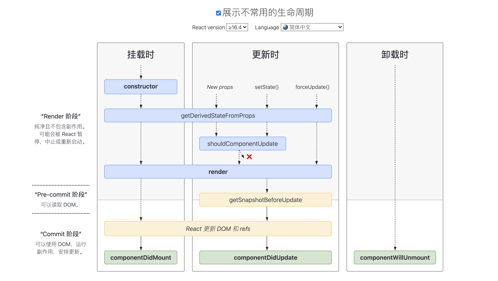

*因为React是一个很大的话题，这篇文章专门用于记录和React有关的零散小点*

## React version
讨论的版本号限于 v16.8.0 <= version <= v17.0.0-alpha

## React生命周期

[React生命周期图解官网链接](https://projects.wojtekmaj.pl/React-lifecycle-methods-diagram/)
React>=16.4的版本开始，生命周期就以上图为准(React>=16开始大结构就如此)，大周期分成三个阶段
 - 初次加载 Mount
 - 更新 Update
 - 卸载 Unmount

需要理解初次加载/更新这两个阶段的生命周期划分为render phase和commit phase，render phase不包含副作用，主要是接收props、进行dom diff、标记side effect，所有的side effect都在commit phase阶段进行

## Fiber
[Fiber相关内容链接](3rdlib/react/fiber.md)

## Hooks
[Hooks相关内容链接](3rdlib/react/hooks.md)

## React Server Components
还在学习计划中