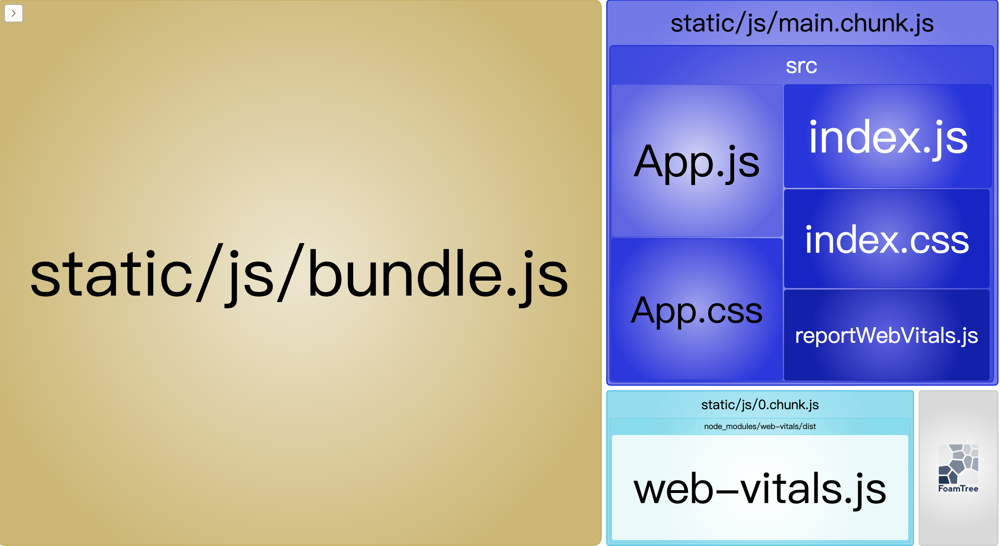
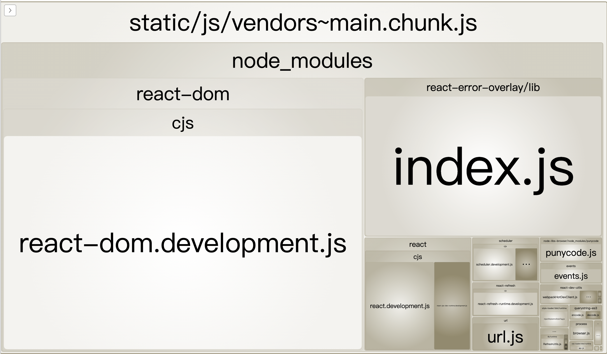
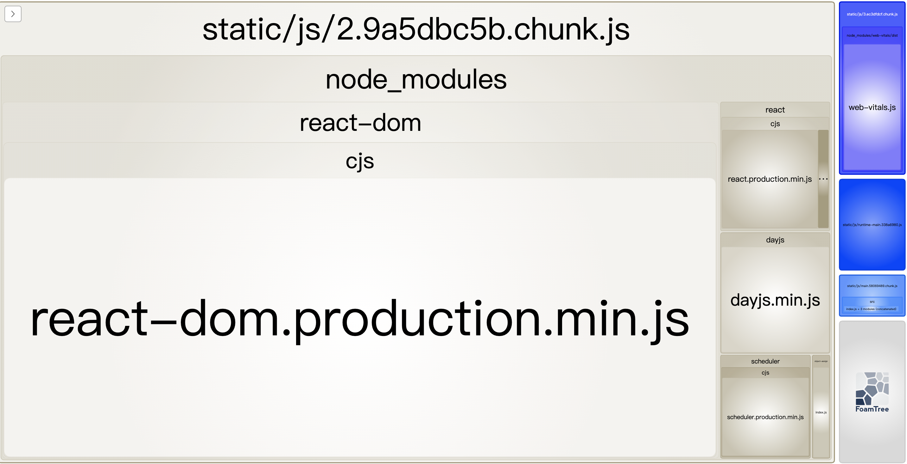

## 分析webpack打包
webpack有个`webpack-bundle-analyzer`的插件是专门用来分析打包代码。安装方法和普通webpack插件无异，使用只需要在webpack.config.plugin中添加配置
```js
...
const BundleAnalyzerPlugin = require('webpack-bundle-analyzer').BundleAnalyzerPlugin;
...
export default {
  ...plugins: [
    ...
    new BundleAnalyzerPlugin({ generateStatsFile: true })
    ...
  ] 
}
```
按默认配置可以在localhost:8888中看到依赖图
以create-react-app创建的react项目为例



实际开发中，更常见的是看build后的依赖图


