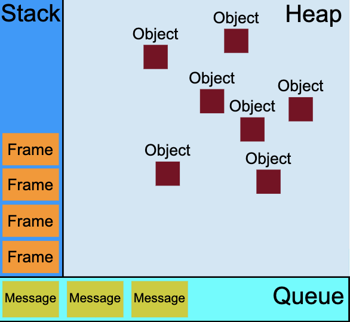
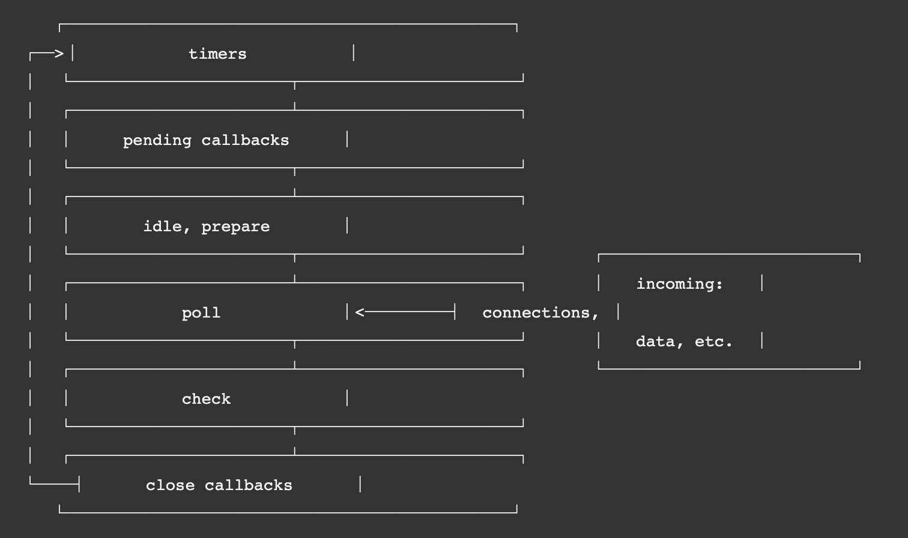

本文讨论Event Loop话题

## process、thread
JS世界有句名言叫“虽然JS是单线程的，但是它从不阻塞I/O”（英文版更熟悉一点`non-blocking I/O operations, while JavaScript is single-threaded`）最直观的例子就是，用户在页面上点击了一次搜索按钮，浏览器会做一次远程请求，但是用户不需要等数据返回依旧可以在界面里键入内容。

仔细剖析一下这个场景来解释一下上面那句话。首先，用户在浏览器里操作，浏览器是一个应用程序，当它工作时在操作系统中的存在形式是一个**进程（process）**（一个tab页就可以是一个进程，除此之外比如插件系统也是一个单独的进程）
文件是以代码的形式存在于计算机的硬盘上，当执行文件时会创建一个进程实例。假设认为现代用户使用的计算机都是支持多进程（multiple process）的（前面说了一个现代浏览器运行的时候就不止一个进程），操作系统会调度CPU资源保证多个进程同时执行且互不干扰。
那多个进程是怎么互不干扰配合工作的？
  1. 首先，计算机可能不止一个CPU，然后CPU分单核和多核，最终执行一项任务的是CPU上的某一个核
  2. 然后，一项任务不是一个进程，而是一个**线程（thread）**，有这样一句名言**线程是CPU调度的最小单位**
  3. 所谓同时执行不一定是真的同时，分并行和并发，并行才是真正同时执行，并发只是以很短的时间片交替执行，给用户感觉是同时执行

那什么是线程呢？
又有一句名言**进程是资源分配的最小单位**，这里不深入解释，只说上面这个例子里，浏览器在运行的时候就是以进程的方式活跃于操作系统中，JS执行程序是浏览器某个进程下的一个线程，JS执行程序不能单独成为一个进程（这里说的很不科学、不严谨，但是这里只是解释一下最前面的例子）。

好，前面说完了进程和线程，那和浏览器不阻塞I/O到底有几毛钱的关系？最直观的联系就是，浏览器运行的时候是某一个进程，其中执行JS代码的是这个进程下的一个线程，然后用户点击搜索调用远程数据，JS不会执行到这儿就停顿住，而是继续执行后面的代码，等到数据返回了，JS再来执行调用远程接口的回调函数。实现这个功能的就是Event Loop机制。

## 浏览器端的Event Loop
理解浏览器的Event Loop之前先厘清几个概念
  - 浏览器的内核并不是只有一个线程在运行，准确地说执行JS的主线程只有一个，这才是`while JavaScript is single-threaded`的真正意义。其他线程有很多，比如UI渲染就有单独的线程，定时器、异步事件触发、异步http请求这些都是常驻线程
  - UI渲染的线程和执行JS的线程是互斥的，这意味着浏览器在执行渲染页面任务的时候不能执行JS
  - 不同的线程是可以同时工作的，比如主线程在执行解释JS，这不影响异步请求http的线程发起请求
  - 多个线程直接的配合可以理解为，JS主线程触发异步任务后会把任务交给对应的线程，主线程会继续执行，执行异步任务的线程执行完后会把结果注册到任务队列中，在Event Loop机制下等待调用

所有任务被分为两类：宏任务（macro task）和微任务（micro task）
宏任务：UI渲染、执行JS脚本、setTimeout/setInterval I/O操作等等
微任务：promise的回调、MutationObserver

浏览器中的执行逻辑是整个JS脚本开始执行（这是一个宏任务），对象会被分到堆中（heap），函数会进入调用栈（stack）。同步代码直接执行，异步代码会被添加到宏任务或者微任务的队列（queue）。当整个脚本执行完，一个宏任务出队，然后执行微任务队列里的所有任务，然后UI渲染线程更新页面，如果发现有web work会执行web work（web work是一个子线程）。如此循环往复，直到宏任务队列和微任务队列都清空。



## NodeJS的Event Loop
NodeJS使用的是v8引擎js解释器，所以这里的Event Loop也是指v8引擎里libuv模块的实现。对应的，每个NodeJS大版本完全可能会更新这部分代码，所以不同版本NodeJS运行的结果可能会不一样。
  > v8引擎这个名字就是借用了汽车里的v8引擎，表示性能强大的意思。在那个年代，跑车还都是大排量自然吸气引擎的汽油车，v8就是指引擎的8个气缸v字形排布。如果换做现在，可能要命名成tesla？

NodeJS的运行机制大致是
  - JS解释器解释代码
  - 遇到事件，会放到事件队列
  - Event Loop就是调度这些事件的机制，在这个机制下事件队列里的事件会被取出到调用堆栈
  - 调用堆栈里的I/O事件被转发给libuv模块
  - libuv有个线程池，按照不同的任务分发给不同的底层单元（一些NodeJS自带的C/C++模块）
  - 这些任务完成后，libuv会把执行结果放回调用堆栈，JS主线程会执行返回结果

整个Event Loop的结构如下



分成6个阶段
  - timers 定时器setTimeout、setInterval等等，timers不是先进先出的，很明显它们先到时间的先执行
  - I/O callbacks 
  - idle & prepare
  - poll 轮询阶段，会遍历队列里的I/O事件，如果队列不为空会在这儿一直等待，直到达到操作系统规定的时间上限，如果队列清空，有setImmediate会走到check阶段，之后有timers才会执行timers
  - check setImmediate执行阶段
  - close callbacks onClose事件的callback在此执行

和浏览器端一样，任务也分成microTask和macroTask，事件分类和浏览器一致。setImmediate算是Node端独有任务.

process.nextTick很特殊，无论当前处在哪个phase，执行完这个phase process.nextTick都会最先执行。理论上process.nextTick才是setImmediate。

## requestIdleCallback和requestAnimationFrame
```js
requestAnimationFrame(callback);
requestIdleCallback((deadline)=>{
    console.log(deadline.timeRemaining(), deadline.didTimeout)
});
```
上面似乎已经讲明了Event Loop，但是在浏览器端还有两个API叫requestIdleCallback和requestAnimationFrame，requestAnimationFrame接收的回调函数会在下一帧开始前执行，requestIdleCallback的函数会在每一帧的空闲时间执行。
requestAnimationFrame的回调函数也是被放入一个队列，这个队列不同于timers的队列，它的触发时机是渲染线程下一次开始渲染之前，而且每次执行都会把队列里的任务清空。
requestIdleCallback获取的是浏览器每一帧渲染间隔时间中的空闲时间（非空闲时间指JS执行时间+渲染执行时间），当然这个函数也支持设置超期时间，如果空闲时间一直不够当超出超期时间则回调会必然执行。